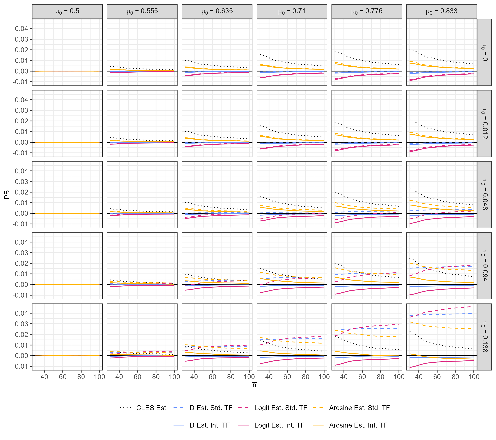
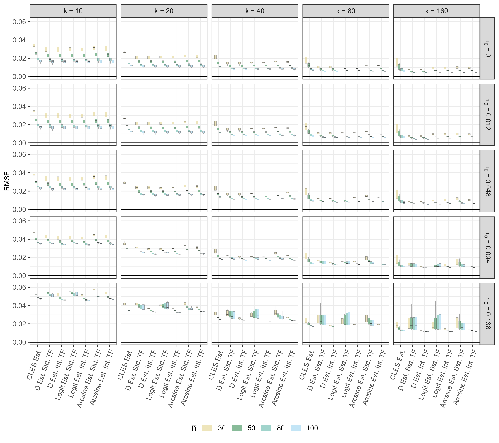
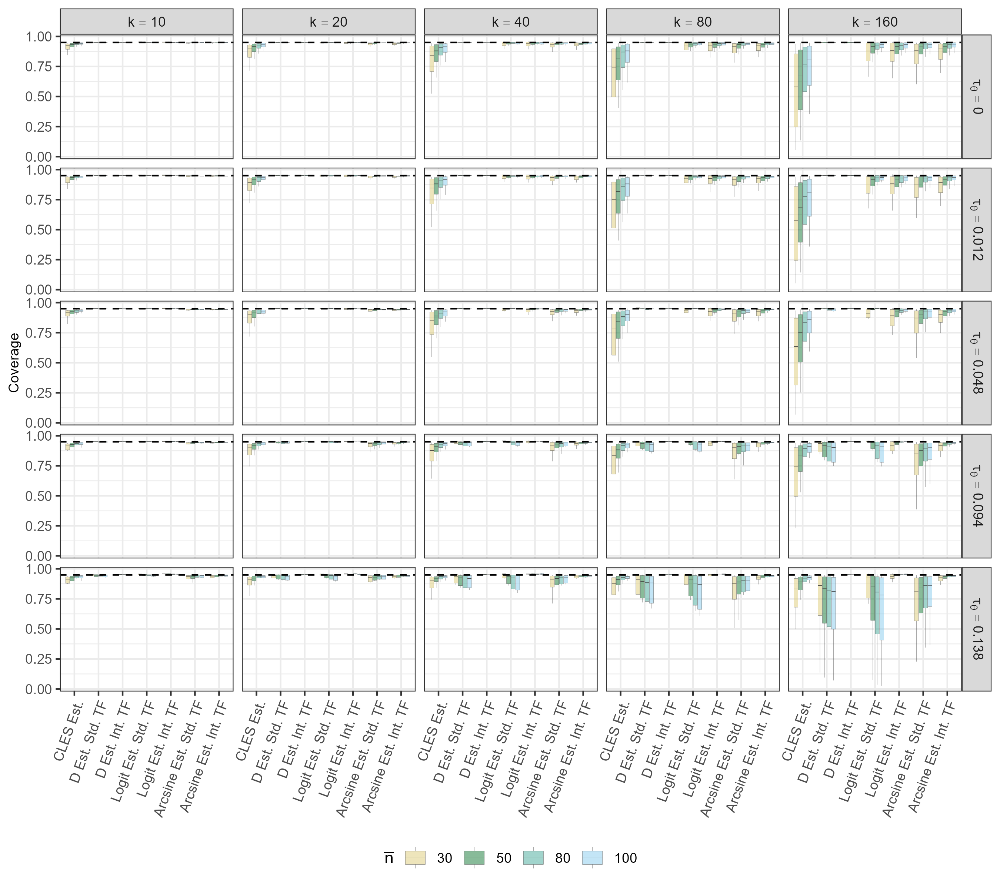

```{r}
rm(list=ls())

library(ggplot2)
library(tidyverse)
library(metafor)
library(kableExtra)
load("results_summary.rdata")

# main analysis
pooled_est      <- results_summary[[1]]
confidence_int  <- results_summary[[2]]

# supplement
pooled_est_pval <- results_summary[[3]]
qtest_pval      <- results_summary[[4]]
tau2_est        <- results_summary[[5]]

pooled_est <- pooled_est |>
  mutate(type_est = case_when(
            type_est == "cles_est" ~ "CLES Est.",
            type_est == "d_int_tf_cles_est" ~ "D Est. Int. TF",
            type_est == "d_tf_cles_est" ~ "D Est. Std. TF",
            type_est == "logit_int_tf_cles_est" ~ "Logit Est. Int. TF",
            type_est == "logit_tf_cles_est" ~ "Logit Est. Std. TF",
            type_est == "arcsin_int_tf_cles_est" ~ "Arcsine Est. Int. TF",
            type_est == "arcsin_tf_cles_est" ~ "Arcsine Est. Std. TF")
         ) |>
  mutate(type_est = factor(type_est, 
  levels = c(
    "CLES Est.",
    "D Est. Std. TF",
    "D Est. Int. TF",
    "Logit Est. Std. TF",
    "Logit Est. Int. TF",
    "Arcsine Est. Std. TF",
    "Arcsine Est. Int. TF")))


confidence_int <- confidence_int |>
 mutate(type_est = case_when(
           type_est == "cles" ~ "CLES Est.",
           type_est == "d_int_tf_cles" ~ "D Est. Int. TF",
           type_est == "d_tf_cles" ~ "D Est. Std. TF",
           type_est == "logit_int_tf_cles" ~ "Logit Est. Int. TF",
           type_est == "logit_tf_cles" ~ "Logit Est. Std. TF",
           type_est == "arcsin_int_tf_cles" ~ "Arcsine Est. Int. TF",
           type_est == "arcsin_tf_cles" ~ "Arcsine Est. Std. TF")
        ) |>
  mutate(type_est = factor(type_est, levels = c(
  "CLES Est.",
  "D Est. Std. TF",
  "D Est. Int. TF",
  "Logit Est. Std. TF",
  "Logit Est. Int. TF",
  "Arcsine Est. Std. TF",
  "Arcsine Est. Int. TF"
)))

pooled_est_pval <- pooled_est_pval |>
  mutate(model = case_when(
            model == "arcsin" ~ "Arcsine Est.",
            model == "cles" ~ "CLES Est.",
            model == "d" ~ "D Est.",
            model == "logit" ~ "Logit Est.")
         ) |>
  mutate(model = factor(model, levels = c(
    "CLES Est.",
    "D Est.",
    "Logit Est.",
    "Arcsine Est.")))

tau2_est <- tau2_est |>
  mutate(model = case_when(
            model == "arcsin" ~ "Arcsine Est.",
            model == "cles" ~ "CLES Est.",
            model == "d" ~ "D Est.",
            model == "logit" ~ "Logit Est.")
         ) |>
  mutate(model = factor(model, levels = c(
    "CLES Est.",
    "D Est.",
    "Logit Est.",
    "Arcsine Est.")))


qtest_pval <- qtest_pval |>
  mutate(model = case_when(
            model == "arcsin" ~ "Arcsine Est.",
            model == "cles" ~ "CLES Est.",
            model == "d" ~ "D Est.",
            model == "logit" ~ "Logit Est.")
         ) |>
  mutate(model = factor(model, levels = c(
    "CLES Est.",
    "D Est.",
    "Logit Est.",
    "Arcsine Est.")))


```


## Motivation

Common measures for two-group comparisons on quantitative outcomes:

  * Mean differences 
  * Standardized mean differences ($d$)
  * Log ratio of means (lnRR)
  * Measures of stochastic superiority ($\theta$)


--------------------------------------------------------------------------------

## Stochastic Superiority ($\theta$)

The probability that a randomly selected person from one group has a higher outcome than a randomly selected person from another group

$$\theta = P(Y>X)+\frac{1}{2}P(Y=X)$$


  * $\frac{1}{2}P(Y=X)$ term handles ties
* Several parametric and non-parametric estimators: 
  * CLES, AUC, Wilcoxon U, Concordance probability, Cliff's $\delta$

[@mcgrawCommonLanguageEffect1992a;@hanleyMeaningUseArea1982; @delongComparingAreasTwo1988a;@newson2002;@cliffDominanceStatisticsOrdinal1993a]{style="display: none;"} 


--------------------------------------------------------------------------------


## Estimating $\theta$: CLES

  * Proposed by @mcgrawCommonLanguageEffect1992a under normality and homoscedasticity
  * Under these assumptions, $d$ completely determines any measure of overlap between two distributions
 
  $$\hat{\theta} = \Phi\left(\frac{d}{\sqrt{2}}\right), \quad \mathrm{var}(\hat{\theta}) = \frac{e^{-d^2 / 2}}{4\pi} \left(\frac{1}{n_1} + \frac{1}{n_2} + \frac{d^2}{2(n_1+n_2)} \right)$$

* There is no comprehensive evaluation on how to best pool CLES estimates


--------------------------------------------------------------------------------


## Meta-analyzing CLES Estimates

* CLES:
  * $\hat{\theta} \in [0, 1]$
  * Sampling distribution is skewed near 0 and 1

* Three transformations of $\hat{\theta}_i$: 
  * logit, arcsine, and probit/SMD
* Two back-transformations to obtain $\hat{\mu}_{\theta}$:
  * Standard
  * Integral
  
  


--------------------------------------------------------------------------------

## Back-transformation Methods for $\hat{\mu}_{\theta}$

Two approaches to estimate $\mu_{\theta}$ after pooling on the transformed scale:

* Standard: 
  * Returns the **median** of the distribution of true effects, not the mean (Jensen's inequality)


* Integral: 
  * Integrates $g^{-1}$ over the normal random-effects distribution 
  * Recovers the **mean** of the distribution of true effects
  * See @igelmannBacktransformationsRandomeffectsMetaanalysisImpact2026


--------------------------------------------------------------------------------


## Data Generation

  1. Sample $k$ true CLES values ($\theta_i$) from $\text{Beta}(\alpha, \beta)$ with moments $(\mu_\theta, \tau^2_\theta)$

  2. Sample study sample sizes from right-skewed distribution ($\gamma_1 \approx 1.45$):
  
<div style="margin-top: -1em; margin-bottom: -1em;">

  $$n_i \sim (\overline{n}/20) \times \chi_{df=4}^2 + (3\overline{n}/10),$$
  
</div>

where $\overline{n}$ is the average sample size for a primary study and assuming equal group sizes [@marin-martinezTestingDichotomousModerators1998; @sanchez-mecaWeightingInverseVariance1998]{style="display: none;"}

3. Generated observed CLES estimates ($\hat{\theta}_i$) implied by the model that
  * Assumed normally distributed outcomes with equal population variances
  * $\sigma_X = \sigma_Y = 1$ and $\mu_X = 0$
  * $\mu_Y$ chosen so that $P(Y>X)=\theta_i$

--------------------------------------------------------------------------------

## Simulation Design

::: {.table-styled}

| Factor | Values |
|:---|:---|
| CLES parameter ($\mu_{\theta}$) | 0.5, 0.555, 0.635, 0.710, 0.776, 0.833 |
| Number of studies ($k$) | 10, 20, 40, 80, 160 |
| Avg. participants per study ($\bar{n}$) | 30, 50, 80, 100 |
| Between-study heterogeneity ($\tau_{\theta}$) | 0, 0.012, 0.048, 0.094, 0.138 |

:::

* 600 conditions $\times$ 10,000 replications each
* $\mu_{\theta}$ and $\tau_{\theta}$ choosen to correspond to commonly observed SMD values
* 7 pooling methods; REML estimation (DL when convergence failed); Knapp-Hartung test
- Performance criteria: bias and RMSE of $\hat{\mu}_{\theta}$; 95% CI coverage; rejection rates and power for test of $H_0: \mu_{\theta} = 0.5$ and Q-test of $H_0: \tau^2 = 0$; bias in $\hat{\tau}_{\theta}$


--------------------------------------------------------------------------------

## Results: Parameter Bias

<!--{width="85%"}-->

```{r}
#| echo: false
#| fig-width: 10
#| fig-height: 6.6
#| fig-align: center

colors_set <- c(
  "CLES Est."            = "black",
  "D Est. Std. TF"       = "#648fff",
  "D Est. Int. TF"       = "#648fff",
  "Logit Est. Std. TF"   = "#dc267f",
  "Logit Est. Int. TF"   = "#dc267f",
  "Arcsine Est. Std. TF" = "#ffb000",
  "Arcsine Est. Int. TF" = "#ffb000"
)

linetypes_set <- c(
  "CLES Est."            = "dotted",
  "D Est. Std. TF"       = "dashed",
  "D Est. Int. TF"       = "solid",
  "Logit Est. Std. TF"   = "dashed",
  "Logit Est. Int. TF"   = "solid",
  "Arcsine Est. Std. TF" = "dashed",
  "Arcsine Est. Int. TF" = "solid"
)

legend_order <- c(
  "CLES Est.",
  "D Est. Std. TF",
  "Logit Est. Std. TF",
  "Arcsine Est. Std. TF",
  " ",                      # blank spacer (one space)
  "D Est. Int. TF",
  "Logit Est. Int. TF",
  "Arcsine Est. Int. TF"
)

colors_set[" "] <- NA
linetypes_set[" "] <- NA

pooled_est |>
  filter(mu_cles >= 0.635) |>
  group_by(type_est, n_bar, tau2_cles, mu_cles) |>
  #mutate(bias = mean(bias)) |>
  #ungroup() |>
  #select(n_bar, bias, type_est, tau2_cles, mu_cles) |>
  #distinct() |>
  summarise(bias = mean(bias), .groups = "drop") |>
  mutate(type_est = factor(type_est, levels = legend_order)) |>
  ggplot(aes(x=n_bar, y=bias, col=type_est, 
             #pch=type_est,
             lty = type_est,
             group=type_est)) +
  geom_hline(yintercept=0, linetype="solid") +
  #geom_point(alpha = .5) + 
  #stat_summary(fun=mean, geom="line") +
  geom_smooth(method = "loess", se = FALSE, span = 0.75, linewidth = 1) +
  facet_grid(tau2_cles ~ mu_cles, labeller = label_bquote(rows = tau[theta] ==.(as.character(sqrt(tau2_cles))), cols = mu[theta] ==.(round(mu_cles, 3)))) +
  labs(x=expression(bar(n)), y="PB", 
       col = NULL, 
       #pch= NULL,
       lty=NULL,
       group = NULL) +
  #scale_shape_manual(values = custom_shapes, breaks = legend_order, drop   = FALSE, na.value = NA) +
  scale_color_manual(values = colors_set, breaks = legend_order, drop   = FALSE, na.value = NA#, name = "method"
                     ) +
  scale_linetype_manual(values = linetypes_set, breaks = legend_order, drop   = FALSE, na.value = NA#, name = "method"
                        ) +
  guides(color = guide_legend(ncol = 4, byrow = TRUE#, 
                              #title ="method"
                              ),
         lty  = guide_legend(ncol = 4, byrow = TRUE#, 
                             #title = "method"
                             )
         #shape = guide_legend(ncol = 4, byrow = TRUE)
         ) +
  theme_bw() +
  theme(legend.position="bottom",
        axis.text.x=element_text(size=13.5),
        axis.text.y=element_text(size=13.5),
        plot.caption=element_text(hjust=0, size=9),
        legend.text=element_text(size=13.5),
        axis.title.x=element_text(size=13.5),
        axis.title.y=element_text(size=13.5),
        strip.text.x=element_text(size=13.5),
        strip.text.y=element_text(size=13.5))


```


--------------------------------------------------------------------------------


## Results: RMSE

<!--{width="85%"}-->


```{r}
#| echo: false
#| fig-width: 10
#| fig-height: 6.5
#| fig-align: center

n_set <- c(
  "30"  = "#ddcc77",
  "50"  = "#117733",
  "80"  = "#44aa99",
  "100" = "#88ccee"
)

pooled_est |>
  filter(k >= 40) |> 
  ggplot(aes(x=type_est, y=rmse, fill=as.factor(n_bar))) +
  geom_hline(yintercept=0, linetype="solid") +
  geom_boxplot(alpha=.5, outlier.shape = NA, lwd=.05) +
  facet_grid(tau2_cles ~ k, labeller = label_bquote(rows = tau[theta] ==.(as.character(sqrt(tau2_cles))), cols = k ==.(k))) +
  labs(x=NULL, y="RMSE", fill=expression(bar(n))) +
  theme_bw() +
  scale_fill_manual(values = n_set) +
  theme(legend.position="bottom",
        axis.text.x = element_text(size = 10),
        axis.text.y=element_text(size=14),
        plot.caption=element_text(hjust=0, size=10),
        legend.text=element_text(size=14),
        axis.title.x=element_text(size=14),
        axis.title.y=element_text(size=14),
        strip.text.x=element_text(size=14),
        strip.text.y=element_text(size=14)) +
  scale_x_discrete(labels = c(expression(hat(theta)),
                              expression(d*"+std"),
                              expression(d*"+int"),
                              expression(l*"+std"),
                              expression(l*"+int"),
                              expression(a*"+std"),
                              expression(a*"+int")
                              )) +
  # scale_x_discrete(labels = c(expression(hat(theta)),
  #                             expression(g[d]*"+std"),
  #                             expression(g[d]*"+int"),
  #                             expression(g[l]*"+std"),
  #                             expression(g[l]*"+int"),
  #                             expression(g[a]*"+std"),
  #                             expression(g[a]*"+int")
  #                             )) +
# labs(
#   caption = "g<sub>d</sub> = SMD transformation; g<sub>l</sub> = logit transformation; g<sub>a</sub> = arcsine transformation. Std = standard back-transformation; Int = integral back-transformation."
#) +
labs(
  caption = expression(
    atop(
      hat(theta) == " CLES directly; d = SMD transformation; l = logit transformation; a = arcsine transformation",
      "std = standard back-transformation; int = integral back-transformation"
    )
  )
) +
theme(
  plot.caption = element_text()
)
```


--------------------------------------------------------------------------------

## Results: Coverage

<!--{width="85%"}-->

```{r}
#| echo: false
#| fig-width: 10
#| fig-height: 6.5
#| fig-align: center


confidence_int |>
  filter(k >= 40) |> 
  ggplot(aes(x=type_est, y=coverage, fill=as.factor(n_bar))) +
  geom_boxplot(alpha=.5, outlier.shape = NA, lwd=.05) +
  geom_hline(yintercept=.95, linetype="dashed") +
  facet_grid(tau2_cles ~ k, labeller = label_bquote(rows = tau[theta] ==.(as.character(sqrt(tau2_cles))), cols = k ==.(k))) +
  labs(x=NULL, y="Coverage", fill=expression(bar(n))) +
  theme_bw() +
  scale_fill_manual(values = n_set) +
  theme(legend.position="bottom",
        axis.text.x = element_text(size = 10),
        axis.text.y=element_text(size=14),
        plot.caption=element_text(hjust=0, size=10),
        legend.text=element_text(size=14),
        axis.title.x=element_text(size=14),
        axis.title.y=element_text(size=14),
        strip.text.x=element_text(size=14),
        strip.text.y=element_text(size=14)) +
  scale_x_discrete(labels = c(expression(hat(theta)),
                              expression(d*"+std"),
                              expression(d*"+int"),
                              expression(l*"+std"),
                              expression(l*"+int"),
                              expression(a*"+std"),
                              expression(a*"+int")
                              )) +
labs(
  caption = expression(
    atop(
      hat(theta) == " CLES directly; d = SMD transformation; l = logit transformation; a = arcsine transformation",
      "std = standard back-transformation; int = integral back-transformation"
    )
  )
) +
theme(
  plot.caption = element_text()
)
#+
# labs(
#   caption = "g<sub>d</sub> = SMD transformation; g<sub>l</sub> = logit transformation; g<sub>a</sub> = arcsine transformation. S = standard back-transformation; I = integral back-transformation."
# ) +
# theme(
#   plot.caption = ggtext::element_markdown()
# )
```


--------------------------------------------------------------------------------

## Results: Coverage -- Integral Methods Only

<!--{width="85%"}-->

```{r}
#| echo: false
#| fig-width: 10
#| fig-height: 6.5
#| fig-align: center


confidence_int |>
  filter(k >= 40) |> 
  filter(type_est != "D Est. Std. TF") |>
  filter(type_est != "Logit Est. Std. TF") |>
  filter(type_est != "CLES Est.") |>
  filter(type_est != "Arcsine Est. Std. TF") |>
  ggplot(aes(x=type_est, y=coverage, fill=as.factor(n_bar))) +
  geom_boxplot(alpha=.5, outlier.shape = NA, lwd=.05) +
  geom_hline(yintercept=.95, linetype="dashed") +
  facet_grid(tau2_cles ~ k, labeller = label_bquote(rows = tau[theta] ==.(as.character(sqrt(tau2_cles))), cols = k ==.(k))) +
  labs(x=NULL, y="Coverage", fill=expression(bar(n))) +
  theme_bw() +
  scale_fill_manual(values = n_set) +
  theme(legend.position="bottom",
        axis.text.x = element_text(size = 10),
        axis.text.y=element_text(size=14),
        plot.caption=element_text(hjust=0, size=10),
        legend.text=element_text(size=14),
        axis.title.x=element_text(size=14),
        axis.title.y=element_text(size=14),
        strip.text.x=element_text(size=14),
        strip.text.y=element_text(size=14)) +
  # scale_x_discrete(labels = c(expression(g[d]^I),
  #                             expression(g[l]^I),
  #                             expression(g[a]^I))) +
scale_x_discrete(labels = c(expression(d*"+int"),
                            expression(l*"+int"),
                            expression(a*"+int"))) +
labs(
  caption = "d = SMD transformation; l = logit transformation; a = arcsine transformation. int = integral back-transformation."
) +
theme(
  plot.caption = ggtext::element_markdown()
)
#+
# labs(
#   caption = "g<sub>d</sub> = SMD transformation; g<sub>l</sub> = logit transformation; g<sub>a</sub> = arcsine transformation. S = standard back-transformation; I = integral back-transformation."
# ) +
# theme(
#   plot.caption = ggtext::element_markdown()
# )
```


--------------------------------------------------------------------------------


## Conclusions and Discussion

* Standard back-transformations are acceptable at low heterogeneity, but integral back-transformation is recommended when $\tau_\theta$ is large
* Under normality and homoscedasticity, SMD with integral back-transformation is the recommended
  * arcsine and logit transformations with the integral back-transformation were comparable across most conditions (except for coverage for moderate $\tau_{\theta}$ and large $k$)
  * Direct pooling should be avoided
<br>

* Next Study: 
  * Extend to non-normal outcomes and unequal population variances and evaluate other estimates (and corresponding sampling variances) of stochastic superiority


--------------------------------------------------------------------------------

## Thank you! Questions? {.center}

```{css}
.center h2 {
  text-align: center;
}
```

--------------------------------------------------------------------------------


## References

::: {#refs}
:::

--------------------------------------------------------------------------------

## Extra Slides {.center visibility="uncounted"}


## Transformations of CLES Estimates

::: {.table-styled}
| Transformation | $g(\hat{\theta})$ | $g^{-1}(t)$ | $\mathrm{var}(g(\hat{\theta}))$ |
|---|---|---|---|
| Logit | $\ln\left(\dfrac{\hat{\theta}}{1-\hat{\theta}}\right)$ | $\dfrac{1}{1+e^{-t}}$ | $\dfrac{1}{\hat{\theta}^2(1-\hat{\theta})^2} \times \mathrm{var}(\hat{\theta})$ |
| Arcsine | $\arcsin\left(\sqrt{\hat{\theta}}\right)$ | $\sin^2(t)$ | $\dfrac{1}{4\hat{\theta}(1-\hat{\theta})} \times \mathrm{var}(\hat{\theta})$ |
| Probit | $\Phi^{-1}(\hat{\theta})$ | $\Phi(t)$ | $\dfrac{1}{\left[\phi(\Phi^{-1}(\hat{\theta}))\right]^2} \times \mathrm{var}(\hat{\theta})$ |
| SMD | $\Phi^{-1}(\hat{\theta})\sqrt{2}$ | $\Phi\left(\dfrac{t}{\sqrt{2}}\right)$ | $\dfrac{1}{n_1} + \dfrac{1}{n_2} + \dfrac{d^2}{2(n_1+n_2)}$ |

: Direct Transformations, Back-transformations, and Sampling Variances

:::


------------------------------------------------------------------------


## Transformations of CLES estimates {data-visibility="hidden"}

Three transformations of $\hat{\theta}$ evaluated:

* Logit:
  * maps $(0,1)$ to the real line; commonly used for proportions; sampling variance derived via delta method
* Arcsine:
  * variance-stabilizing transformation from the proportion literature; restricted range $[0, \pi/2]$; sampling variance derived via delta method
* SMD: 
  * probit transformation scaled by $\sqrt{2}$; one-to-one mapping $\hat{\theta} = \Phi(d/\sqrt{2})$; sampling variance is exactly $\mathrm{var}(\hat{d})$


------------------------------------------------------------------------

## Back-transformation Methods

::: {.table-styled}
| Transformation | Integral |
|:---|:---:|
| Logit | $\displaystyle\int_{-\infty}^{\infty} \dfrac{1}{1+e^{-t}} \, \phi(t \mid \mu, \tau^2) \, dt$ |
| Arcsine | $\displaystyle\int_{0}^{\pi/2} \sin^2(t) \, \dfrac{\phi(t \mid \mu, \tau^2)}{\Phi\left(\frac{\pi/2-\mu}{\tau}\right) - \Phi\left(\frac{-\mu}{\tau}\right)} \, dt$ |
| Probit | $\displaystyle\int_{-\infty}^{\infty} \Phi(t) \, \phi(t \mid \mu, \tau^2) \, dt$ |
| SMD | $\displaystyle\int_{-\infty}^{\infty} \Phi\left(\dfrac{t}{\sqrt{2}}\right) \phi(t \mid \mu, \tau^2) \, dt$ |

: Integral Back-Transformations for Each Method

:::


------------------------------------------------------------------------


## Further Details on Between-study Heterogeneity

* Specified $\mu_{\theta}$ and $\tau_{\theta}^2$ values as the moments of the beta distribution

* Found the $\alpha$ and $\beta$ parameters of the beta distribution by: $\alpha = \mu_{\theta} \times \nu$ and $\beta = (1 - \mu_{\theta})\nu$ where $\nu = (\alpha + \beta) =\frac{\mu_{\theta}(1 - \mu_{\theta})}{\tau^2_{\theta}} - 1$.
  * *Note*. values must meet the following condition: $\nu = (\alpha + \beta) > 0$, so therefore $\tau^2_{\theta} < \mu_{\theta}(1 - \mu_{\theta})$
* For the specified $\mu_{\theta}$ and $\tau_{\theta}^2$,  we derived them from SMD parameters through numerical integration
  * specified all 20 pairwise combinations of the following: $\mu_d = \{0, 0.2, 0.5, 0.8, 1.1, 1.4\}$ and $\tau_d = \{0, 0.05, 0.20, 0.40, 0.60\}$


------------------------------------------------------------------------

## Beta Distributions

```{r}
#| echo: false
#| fig-width: 10
#| fig-height: 6
#| fig-align: center

design_factors <- list(
  mu = c(0.5, 0.555, 0.635, 0.710, 0.776, 0.833),
  tau2 = c(0.012, 0.048, 0.094, 0.138)^2)


beta_parms <- function(mu, tau2) {
  
  if (tau2 < mu * (1 - mu)) {
    
    nu <- ((mu * (1 - mu))/tau2) - 1
    alpha <- mu * nu
    beta <- (1 - mu) * nu
    
    return(c(alpha=alpha, beta=beta))
    
  } else {
    
    print("the combination of variance and mu values violates condition where (alpha + beta) > 0")
    
  }
  
}

params <- expand.grid(design_factors)

results <- plyr::mdply(params, .fun = beta_parms, .inform = TRUE, .parallel = FALSE)

tau2_colors <- c("#4E9F7D", "#C75B4E", "#5B7FA6", "#D4A849")

x_seq <- seq(0, 1, length.out = 1001)

plot_data <- do.call(rbind, lapply(1:nrow(results), function(x) {
  data.frame(
    x = x_seq,
    y = dbeta(x_seq, results$alpha[x], results$beta[x]),
    mu = results$mu[x],
    tau2 = results$tau2[x]
  )
}
)
)

plot_data <- plot_data |>
  mutate(
    mu_label = factor(paste0("mu == ", round(mu, 3)), levels = paste0("mu == ", round(sort(unique(mu)), 3))),
    tau_label = factor(paste0("tau == ", round(sqrt(tau2), 3)), levels = paste0("tau == ", round(sort(unique(sqrt(tau2))), 3)))
  )

ggplot(plot_data, aes(x = x, y = y, color = tau_label)) +
  geom_line(linewidth = 1) +
  facet_wrap(~ mu_label, nrow = 2, ncol = 3, labeller = label_parsed) +
  scale_color_manual(values = tau2_colors, labels = parse(text = levels(plot_data$tau_label)), name = "") +
  labs(title = expression(bold(paste("Beta Distributions by ", mu, " and ", tau, " Values"))),
       x = "",
       y = "PDF") +
  theme_bw()  +
  theme(plot.title      = element_text(hjust = 0.5, size = 14),
        strip.text      = element_text(size = 11),
        legend.position = "bottom",
        legend.title    = element_text(size = 11),
        legend.text     = element_text(size = 11),
        panel.grid.minor = element_blank())
```

## Obtaining CLES Estimates


1. After obtaining true CLES values, then transform to true SMD values:

<div style="margin-top: -1em; margin-bottom: -1em;">

  $$
  g_{\text{d}}(\theta_i) = \Phi^{-1}(\theta_i)\sqrt{2}
  $$
  
</div>
  
  3. Generate observed SMD estimates from a scaled non-central $t$-distribution assuming homoscedastic variances:
  
<div style="margin-top: -1em; margin-bottom: -1em;">  

$$g_{\text{d}}(\hat{\theta_i}) \sim N\left(g_{\text{d}}(\theta_i),  \sqrt{\frac{1}{n_1} + \frac{1}{n_2}}\right) \bigg/ \sqrt{\frac{\chi^2(df= n_1+n_2 -2)}{n_1 + n_2 -2}}$$

</div>


